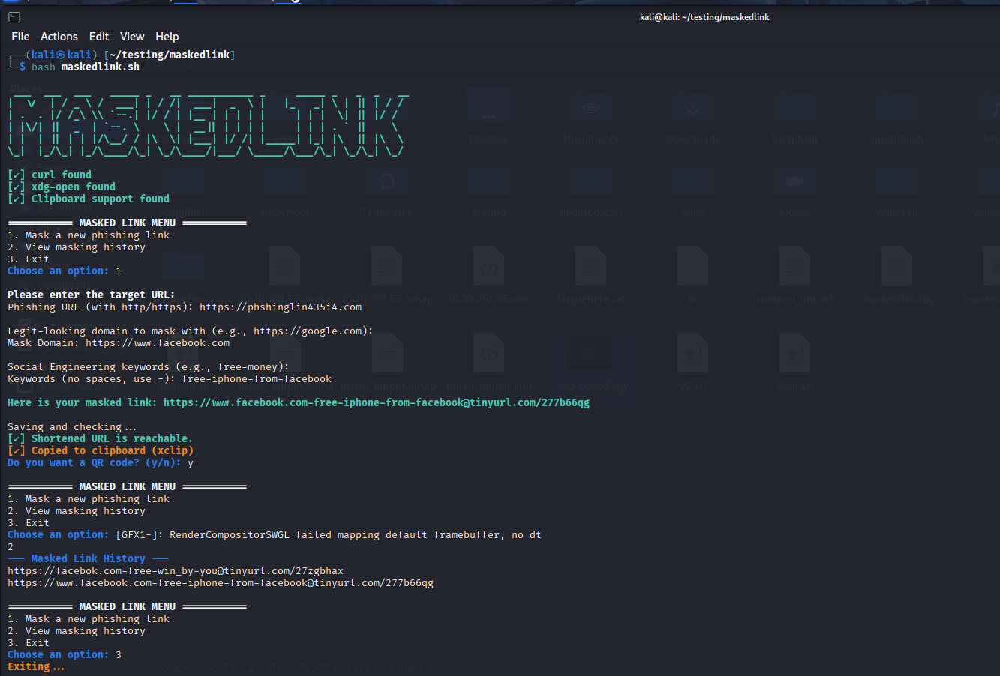

# 🎭 MASKED LINK v2

A **Bash-based URL masking tool** designed for ethical use in cybersecurity demonstrations and education. Masked Link v2 provides a menu-driven interface to create masked URLs that look legitimate, helping you understand how attackers manipulate links and train users against phishing attempts.

> ⚠️ **Educational Use Only:** This tool is intended for ethical hacking and security training purposes only. Do **not** use it for malicious or illegal activity.

---
## 📸 Screenshot


## 🚀 Features

- 📜 Menu-Based Interactive Interface
- 🔧 Tool Availability Check with Installation Guidance
- ✅ Validates and Previews Masked URLs
- 🧾 History Logging & Link Archiving
- 📋 Clipboard Auto-Copy (xclip/pbcopy)
- 📸 Optional QR Code Generation via API
- 🌐 Live Link Availability Checker

---

## 📦 Prerequisites

Ensure the following tools are installed:

- `bash` (Default on most Linux distros)
- `curl` (For shortening and checking links)
- `xdg-open` or `open` (To preview QR code)
- *(Optional)* `xclip` or `pbcopy` (Clipboard support)

You can install missing tools using:

```bash
sudo apt install curl xdg-utils xclip
````

---

## 📂 Files Included

* `maskedlink.sh` - Main Bash script
* `masked_links_history.txt` - Stores history of generated links
* `maskedlink.log` - Timestamped log file for audit/reference

---

## 🧑‍💻 Usage

### 🔧 Run the Script

```bash
git clone https://github.com/faiquehere/maskedlink
cd maskedlink
chmod +x maskedlink.sh
./maskedlink.sh
```

### 📜 Menu Options

```
1. Mask a new phishing link
2. View masking history
3. Exit
```

### 🛠️ Masking Workflow

1. Enter a **target URL** (must start with http/https).
2. Choose a **legit-looking masking domain** (e.g., `https://google.com`).
3. Add **keywords** to make it more convincing (e.g., `free-money`, `login-now`).
4. Final masked format:

   ```
   https://google.com-free-money@tinyurl.com/xyz123
   ```
5. Tool checks if link is live.
6. Link is optionally previewed as a QR code.
7. Masked link is saved in history and copied to clipboard.

---

## 📜 Example Output

```bash
Phishing URL (with http/https): http://malicious-site.com
Mask Domain: https://facebook.com
Keywords: win-prizes

Here is your masked link:
https://facebook.com-win-prizes@tinyurl.com/abcd123
```

---

## 🔐 Security & Ethics

This tool is a **red-teaming aid** meant for:

* Cybersecurity workshops
* Security awareness training
* Ethical hacking demonstrations

> **Use responsibly. Never use this tool to deceive, harm, or violate laws.**

---

## 📝 License

This project is open-source under the [MIT License](LICENSE).

---

## 🙌 Contributions

Pull requests and improvements are welcome! If you'd like to add features like:

* Auto-updater
* Language localization
* Alternate URL shorteners

Feel free to fork and contribute.

---

## 📧 Contact

Created by **Faique Ali Khan**
Reach out via GitHub or faiquealikk@gmail.com

